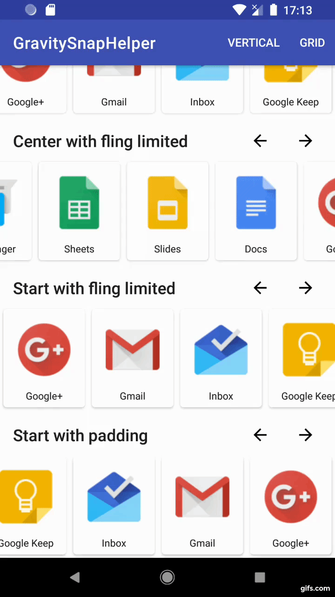

# GravitySnapHelper

A SnapHelper that snaps a RecyclerView to an edge.

## Setup

Add this to your build.gradle:

```groovy
implementation 'com.github.rubensousa:gravitysnaphelper:2.2.2'
```

## How to use

You can either create a GravitySnapHelper, or use GravitySnapRecyclerView.

If you want to use GravitySnapHelper directly, 
you just need to create it and attach it to your RecyclerView:

```kotlin
val snapHelper = GravitySnapHelper(Gravity.START)
snapHelper.attachToRecyclerView(recyclerView)
```

If you want to use GravitySnapRecyclerView, you can use the following xml attributes for customisation:

```xml
<attr name="snapGravity" format="enum">
<attr name="snapEnabled" format="boolean" />
<attr name="snapLastItem" format="boolean" />
<attr name="snapToPadding" format="boolean" />
<attr name="snapScrollMsPerInch" format="float" />
<attr name="snapMaxFlingSizeFraction" format="float" />
```

Example:

```xml
<com.github.rubensousa.gravitysnaphelper.GravitySnapRecyclerView
    android:id="@+id/recyclerView"
    android:layout_width="match_parent"
    android:layout_height="wrap_content"
    app:snapGravity="start" />
```

## Start snapping

```kotlin
val snapHelper = GravitySnapHelper(Gravity.START)
snapHelper.attachToRecyclerView(recyclerView)
```

</img>

## Center snapping

```kotlin
val snapHelper = GravitySnapHelper(Gravity.CENTER)
snapHelper.attachToRecyclerView(recyclerView)
```

</img>

## Limiting fling distance

If you use  **setMaxFlingSizeFraction** or **setMaxFlingDistance** 
you can change the maximum fling distance allowed.

</img>


## With decoration

</img>

## Features 

1. **setMaxFlingDistance** or **setMaxFlingSizeFraction** - changes the max fling distance allowed.
2. **setScrollMsPerInch** - changes the scroll speed.
3. **setGravity** - changes the gravity of the SnapHelper.
4. **setSnapToPadding** - enables snapping to padding (default is false)
5. **smoothScrollToPosition** and **scrollToPosition**
6. RTL support out of the box

## Nested RecyclerViews

Take a look at these blog posts if you're using nested RecyclerViews

1. [Improving scrolling behavior of nested RecyclerViews](https://rubensousa.com/2019/08/16/nested_recyclerview_part1/)

2. [Saving scroll state of nested RecyclerViews](https://rubensousa.com/2019/08/27/saving_scroll_state_of_nested_recyclerviews/)


## License

    Copyright 2018 The Android Open Source Project
    Copyright 2019 Rúben Sousa
    
    Licensed under the Apache License, Version 2.0 (the "License");
    you may not use this file except in compliance with the License.
    You may obtain a copy of the License at
    
        http://www.apache.org/licenses/LICENSE-2.0
    
    Unless required by applicable law or agreed to in writing, software
    distributed under the License is distributed on an "AS IS" BASIS,
    WITHOUT WARRANTIES OR CONDITIONS OF ANY KIND, either express or implied.
    See the License for the specific language governing permissions and
    limitations under the License.
